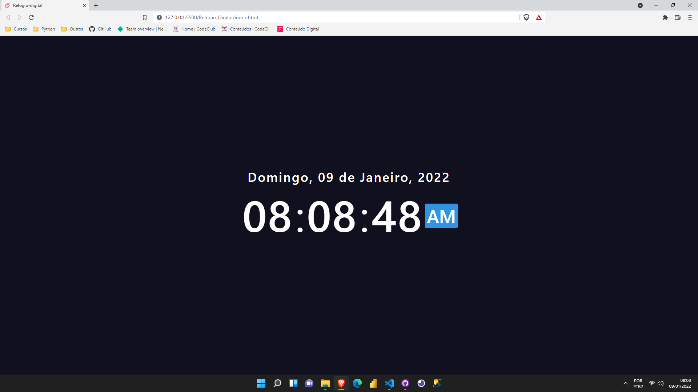
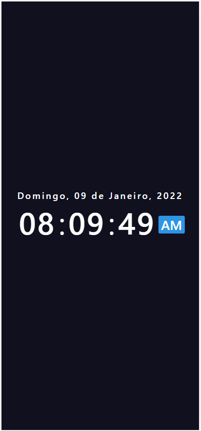

<h1>⌚ Project watch </h1>

With a simple, minimalist and fully responsive layout, an interface was created for the user to access a website from a digital clock.
##
### 🚀 Technologies
 
This project was developed with the following technologies:

- <a href="https://en.wikipedia.org/wiki/HTML">HTML</a>
- <a href="https://en.wikipedia.org/wiki/CSS">CSS</a>
- <a href="https://en.wikipedia.org/wiki/JavaScript">Javascript</a>
- <a href="https://code.visualstudio.com/">VS Code</a>

##
### 📝 License

This project is open to the public, to access and test.

If you want to test <a href="https://gabrielprt.github.io/Projeto_conversor_moeda/">click here</a> 🎯

Created by 😁 Gabriel Prates 👋 <a href="https://github.com/GabrielPrt">Get in touch!</a>
